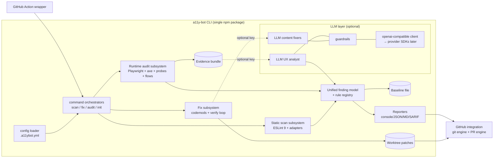

# a11y-bot — v1 Design

Status: baseline design, approved 2026-07-08.
Canonical source of truth for requirements and architecture. Issues are derived
from this document via [ISSUE_PLAN.md](./ISSUE_PLAN.md).

---

## 1. Product overview

**a11y-bot** detects accessibility violations in web front-end repositories from
two directions — static source analysis and real-browser runtime auditing — and
**opens automated fix pull requests** for violations it can repair safely.

One sentence: *"An open-source accessibility bot: scan your repo and your running
pages, gate CI on regressions, and receive ready-to-review fix PRs."*

### Value propositions

1. **Fix PRs, not just reports** — deterministic codemods repair safe violations;
   optional LLM assistance repairs content-required ones (e.g., alt text).
2. **UX-aware runtime audit** — a real browser collects evidence (focus order,
   keyboard reachability, reflow, target size, axe violations, scripted user
   flows); an optional LLM pass turns evidence into human-readable UX findings.
3. **Zero-infrastructure adoption** — an npm CLI plus a GitHub Action; no hosted
   service, no account, no API key required for the deterministic core.

### Personas

| Persona | Need |
|---|---|
| Front-end dev (React/Vue) | Catch and auto-fix a11y issues before review |
| OSS maintainer | Scheduled fix PRs like dependabot, minimal setup |
| QA / a11y champion | Runtime evidence + UX findings reports; CI gate on regressions |

### Explicitly decided (owner-approved 2026-07-08)

Hybrid detection with fixes only from static findings (ADR-001); reuse of existing
ESLint a11y plugins (ADR-002); CLI core + Action wrapper (ADR-003); LLM optional,
OpenAI-compatible first, SDK multi-provider later (ADR-004); deterministic evidence
+ post-hoc LLM analysis, no autonomous browser agent in v1 (ADR-005);
scheduled-scan→fix-PR write path, read-only PR checks (ADR-006); TS/Node 22 stack
(ADR-007); MIT + English messages (ADR-008).

---

## 2. Scope

### 2.1 v1 scope

- Static scan of `.html`, `.jsx`, `.tsx`, `.vue` sources → unified findings.
- Deterministic fix engine + fix PR creation.
- Optional LLM content fixes (alt text, aria-label suggestions) behind env key.
- Runtime audit (Playwright chromium): axe scan, deterministic probes, scripted
  flows, evidence bundle, optional LLM UX analysis.
- Reports: console, JSON, Markdown, SARIF; baseline with fail-on-new semantics.
- GitHub Action wrapper + documented workflow templates.
- Multi-provider LLM SDK layer (final wave; not MVP-blocking).

### 2.2 v1 non-goals (v2 candidates)

- GitHub App / hosted service; webhook-driven operation.
- Autonomous LLM browser agent; runtime-finding→source auto-fix.
- Suggested-changes comments on user PRs; auto-commit to user branches.
- Site crawling (v1 audits only explicitly configured targets/flows).
- Svelte, Astro, Angular templates, server template languages (ERB/Jinja/PHP).
- Custom user-defined lint rules; plugin system.
- Japanese (or other) localized output; color-contrast static approximation;
  multi-browser (firefox/webkit) audit matrix.
- Organization-wide dashboards, trend storage beyond the baseline file.

### 2.3 Known unknowns (tracked; may spawn issues during implementation)

| # | Unknown | Trigger to resolve |
|---|---|---|
| U1 | Exact vision capability & id of default LLM model (`gpt-5.4-mini` candidate) | Issue 18 implementation |
| U2 | eslint-plugin-jsx-a11y ESLint 10 support timing | Dependency watch; ADR-002 |
| U3 | SARIF ingestion quirks (result caps, fingerprint stability) on GitHub | Issue 11 validation |
| U4 | Focus-visibility heuristic false-positive rate on real sites | Issue 23 fixture tuning |
| U5 | ESLint autofix output quality inside `.vue` templates | Issue 16 spike, fallback: attribute-level text edits |
| U6 | npm publish name final check (`a11y-bot` free as of 2026-07-08) | Issue 36 |
| U7 | Evidence screenshot size vs Action artifact limits | Issue 26 |

---

## 3. Conformance target

- Default ruleset targets **WCAG 2.2 Level AA** (= ISO/IEC 40500:2025).
- Per-rule metadata: WCAG SC references + minimum conformance level + version
  (`2.0`/`2.1`/`2.2`); nothing maps to removed SC 4.1.1.
- JIS X 8341-3: revision to an identical standard of ISO/IEC 40500:2025 is in
  progress (draft target ~2026-05). Docs ship a correspondence note; see
  [research](./research/2026-07-standards-wcag-jis.md).
- Per-rule level metadata surfaces in all reports so users can filter by
  conformance level downstream; a dedicated `--level` gate flag is deferred to
  v2 (gating in v1 is severity-based via `report.failOn`).

---

## 4. System architecture



Execution contexts: local shell, any CI, or the bundled GitHub Action. All three
call the same CLI entry points.

---

## 5. Repository layout

```
a11y-bot/
├─ action.yml                  # GitHub Action manifest (issue 31)
├─ action/                     # Action entry (bundled to dist/action)
├─ src/
│  ├─ cli/                     # commander wiring: index.ts,
│  │                           # commands/{init,scan,fix,fix-pr,audit}.ts
│  ├─ config/                  # schema.ts (zod), load.ts, init.ts
│  ├─ core/                    # findings.ts, registry.ts, fingerprint.ts, messages/,
│  │                           # errors.ts, exit-codes.ts, logger.ts, run-context.ts
│  ├─ static/                  # eslint-runner.ts, discover.ts, adapters/{jsx,vue,html}.ts,
│  │                           # rule-maps/{jsx,vue,html}.ts
│  ├─ fix/                     # engine.ts, patch.ts, verify.ts,
│  │                           # fixers/{html,jsx,vue}/*.ts, catalog.ts
│  ├─ llm/                     # client.ts, providers/{openai-compatible.ts,...},
│  │                           # guardrails.ts, fixers/alt-text.ts, analyst.ts, budget.ts
│  ├─ audit/                   # provision.ts, session.ts, axe.ts, outline.ts,
│  │                           # probes/{focus-order,keyboard-reach,reflow,target-size}.ts,
│  │                           # flows.ts, evidence.ts
│  ├─ report/                  # console.ts, json.ts, markdown.ts, sarif.ts, baseline.ts
│  └─ github/                  # git.ts, pr.ts, identity.ts
├─ schemas/                    # generated JSON Schemas (config, findings, evidence, flows)
├─ fixtures/                   # test fixture projects (issue 34)
├─ examples/workflows/         # pr-check.yml, scheduled-fix.yml, audit.yml (issue 32)
└─ docs/                       # this design, ADRs, research, issues
```

---

## 6. Configuration

### 6.1 File and precedence

- File: `.a11ybot.yml` (YAML 1.2) at repo root; `--config <path>` overrides.
- Precedence: CLI flags > environment variables > config file > built-in defaults.
- Validation: zod schema; unknown keys are **errors** (typo safety). A JSON Schema
  is generated from zod and published to `schemas/a11ybot.schema.json` for editor
  completion (`$schema` support).
- `a11y-bot init` writes a commented starter config (idempotent; refuses to
  overwrite without `--force`).

### 6.2 Schema (normative for issue 02; excerpt shows defaults)

```yaml
version: 1                          # int, required, only 1 accepted
scan:
  include: ["**/*.html", "**/*.jsx", "**/*.tsx", "**/*.vue"]
  exclude: []                       # merged with built-ins: node_modules/, dist/, build/,
                                    # coverage/, .git/, vendored dirs; .gitignore respected
  rules: {}                         # map: unified rule id -> "off" | "warn" | "error"
  maxFiles: 5000                    # hard cap, run aborts with config error above it
fix:
  classes: [auto_safe]              # which fixability classes `fix` may apply:
                                    # auto_safe | auto_review
  llm: false                        # allow content_required fixes via LLM
  defaults:
    lang: null                      # e.g. "en" enables deterministic html-lang fix
baseline:
  file: .a11ybot/baseline.json
audit:
  targets: []                       # see 6.3
  viewports:                        # name: ^[a-z0-9-]{1,20}$ (evidence path component)
    - { width: 1280, height: 800, name: desktop }
    - { width: 375,  height: 812, name: mobile }
  probes: [axe, focus-order, keyboard-reach, reflow, target-size, structure]
  flows: []                         # see 11.5; flows[].viewport must reference
                                    # a viewports[].name (default: first viewport)
  includeIncomplete: false          # axe "incomplete" results as advisory findings
  llmAnalysis: false                # explicit enable for the LLM UX analyst (§10.3)
  evidenceDir: .a11ybot/evidence
  keepRuns: 3                       # retention; 0 = keep all
  scrubParams: [token, key, session, auth]   # query params masked in evidence
  pageTimeoutMs: 30000
  maxScreenshots: 40                # per run
llm:
  provider: openai-compatible       # v1: openai-compatible; wave-6 adds sdk providers
  baseUrl: https://api.openai.com/v1
  model: gpt-5.4-mini
  apiKeyEnv: A11YBOT_LLM_API_KEY    # name of env var holding the key
                                    # fallback env: OPENAI_API_KEY
  capabilities: null                # null = provider-declared; or override:
                                    # { vision: false } for non-vision endpoints
  maxCalls: 20                      # per run
  maxOutputTokens: 2000             # per call
  timeoutMs: 60000
report:
  formats: [console]                # console | json | markdown | sarif
  outputDir: .a11ybot/reports
  failOn: serious                   # minimum severity of NEW findings that fails CI
github:
  branchPrefix: a11y-bot/           # MUST match ^a11y-bot\/ (schema-enforced);
                                    # customization like a11y-bot/team-x- is allowed
  labels: [accessibility]
  prTitle: "fix(a11y): automated accessibility fixes"
  closeEmptyPr: true                # close the bot PR when no diff remains
  commitIdentity:                   # optional override of the bot git identity
    name: a11y-bot
    email: a11y-bot[bot]@users.noreply.github.com
```

### 6.3 `audit.targets[]` variants (discriminated union)

```yaml
- name: prod-home            # required, unique, [a-z0-9-]{1,40}
  url: https://example.com/  # variant A: audit a reachable URL as-is
                             #   optional readyTimeoutMs (default 60000);
                             #   readiness = GET 2xx/3xx
- name: built
  staticDir: dist/           # variant B: serve directory on an ephemeral port
  spaFallback: true          #   index.html fallback for SPA routers
- name: dev
  command: "npm run dev"     # variant C: run command, wait for port, audit, teardown
  port: 3000
  readyPath: /
  readyTimeoutMs: 60000
```

### 6.4 Environment variables

| Variable | Meaning |
|---|---|
| `A11YBOT_LLM_API_KEY` (or configured `apiKeyEnv`, fallback `OPENAI_API_KEY`) | LLM key; presence enables LLM features where allowed by config/flags |
| `GITHUB_TOKEN` / `GH_TOKEN` | Token for PR engine (first found wins) |
| `A11YBOT_LOG` | `debug` \| `info` (default) \| `quiet` |
| `NO_COLOR` | Disable ANSI colors (also auto-off when not a TTY) |

Secrets are only ever read from env — never from config files, never written to
logs, reports, or evidence (see §14).

---

## 7. Unified finding model

### 7.1 Types (normative for issue 03)

```ts
type Severity = "critical" | "serious" | "moderate" | "minor";
type Engine   = "static" | "runtime" | "ux";
type Fixability = "auto_safe" | "auto_review" | "content_required" | "manual" | "none";

interface Finding {
  schemaVersion: 1;
  fingerprint: string;          // stable id, see 7.3
  ruleId: string;               // unified id, see 7.2
  engine: Engine;
  severity: Severity;
  message: string;              // resolved from message catalog (English)
  wcag: WcagRef[];              // [] allowed only when bestPractice === true
  bestPractice?: true;
  // static engine:
  file?: string;                // repo-relative POSIX path
  range?: { start: Pos; end: Pos };   // Pos = { line: number; column: number } 1-based
  snippet?: string;             // <= 200 chars, sanitized
  // runtime/ux engines:
  target?: { name: string; url: string; selector?: string; viewport?: string };
  evidenceRefs?: string[];      // paths inside evidence bundle
  fixability: Fixability;
  source: { tool: string; version: string; ruleId: string }; // upstream provenance
  advisory?: true;              // never affects exit code. Always set on ux
                                // findings; runtime findings may set it for
                                // non-normative observations (axe "incomplete",
                                // focus-order-jump, probe-timeout)
  confidence?: number;          // 0..1, ux engine only (analyst output)
  baselineStatus?: "new" | "known";   // annotated by the baseline layer (§12.2)
}

interface WcagRef { sc: string; level: "A" | "AA"; version: "2.0" | "2.1" | "2.2"; }
```

### 7.2 Unified rule ids

`<engine>/<source>/<rule>` — examples:
`static/jsx-a11y/alt-text`, `static/html-eslint/require-img-alt`,
`static/vuejs-a11y/form-control-has-label`, `runtime/axe/color-contrast`,
`runtime/probe/focus-visible`, `ux/llm/navigation`.

The **rule registry** (`src/core/registry.ts`) is the single map from unified id →
`{ wcag, defaultSeverity, fixability, messageId, docsUrl, enabled, configGated? }`
(`configGated` names a config path — e.g. `fix.defaults.lang` — that must be set
for an `auto_safe` fixer to activate; `enabled: false` rows exist for upstream
rules we map but do not run). Adapters must fail a CI completeness test if an
upstream rule lacks a registry entry (see issues 06–08).

Exception — **dynamic namespaces**: rule sets defined by an external engine at
finding time (`runtime/axe/*`, `ux/llm/*`) register a namespace template entry
instead of per-rule rows; for these, severity and WCAG refs are required inputs
on each finding (validated at construction) rather than registry constants.

### 7.3 Fingerprint (stable across line drift)

```
fingerprint = sha256(
  schemaVersion + "\0" + ruleId + "\0" +
  (file ?? target.name + "|" + normalizedSelector) + "\0" +
  normalizedSnippet + "\0" + occurrenceIndex
).hex().slice(0, 32)
```

- `normalizedSnippet`: finding's source text with whitespace collapsed, max 200 chars.
- `occurrenceIndex`: 0-based index among findings in the same file with identical
  (ruleId, normalizedSnippet) — keeps duplicates distinct yet line-independent.
- Runtime findings use `normalizedSelector` (axe target selector, stripped of
  volatile `nth-child` where an `id`/`data-testid` exists).

### 7.4 Severity normalization

| Source | Mapping |
|---|---|
| axe impact | critical→critical, serious→serious, moderate→moderate, minor→minor |
| ESLint plugins | per-rule assignment in registry (default serious for WCAG A failures, moderate for AA, minor for best-practice) |
| probes | fixed per probe (registry) |
| ux/llm | always `advisory: true`; severityHint mapped onto the standard enum for display only (§10.3), never gates |

---

## 8. Static scan subsystem

### 8.1 Engine

- `ESLint` **9.x pinned** (ADR-002), used via `new ESLint({ overrideConfigFile: true, baseConfig: <built-in flat config>, ... })` so user ESLint config is ignored.
- File discovery (`src/static/discover.ts`): `scan.include` globs minus
  `scan.exclude`, built-in excludes, and `.gitignore` entries; symlinks not
  followed; files > 1 MiB skipped with a warning finding (`static/bot/file-skipped`).
- One ESLint instance per filetype family with the appropriate parser:

| Filetype | Parser | Plugin(s) | Preset |
|---|---|---|---|
| `.html` | `@html-eslint/parser` | `@html-eslint/eslint-plugin` | accessibility category (17, see research) + a11y-relevant extras from other categories: `require-lang` (3.1.1), `require-title` (2.4.2) — exact extra set fixed in issue 08 |
| `.jsx/.tsx` | `typescript-eslint` parser (jsx: true, **no type-aware linting** in v1) | `eslint-plugin-jsx-a11y` | `flat/recommended` |
| `.vue` | `vue-eslint-parser` (template + script) | `eslint-plugin-vuejs-accessibility` | `flat/recommended` |

### 8.2 Adapters

Each adapter converts `ESLint.LintResult[]` → `Finding[]`:
resolve unified rule id via rule map, attach WCAG refs/severity/fixability from
registry, compute fingerprint, resolve message from catalog (fallback: upstream
message), capture snippet from source text. Rule maps are **exhaustive tables
over the adapter's rule scope**, validated by the completeness test. Rule scope:
for `jsx-a11y` and `vuejs-accessibility`, every rule the plugin exports (rows may
be `enabled: false`); for `@html-eslint`, the enabled a11y set defined in issue 08
(the plugin's style/SEO categories are out of scope).

### 8.3 Config-level rule control

`scan.rules` overrides default severities (`off|warn|error` mapped to
off / minor / keep-registry-severity-but-gate). `warn` findings never fail CI.

---

## 9. Fix subsystem

### 9.1 Fixability classes

| Class | Meaning | Applied when |
|---|---|---|
| `auto_safe` | Mechanical, semantics-preserving or strictly corrective | default (`fix.classes`) |
| `auto_review` | Correct in the common case but may change author intent (e.g., removing an invalid role) | only if enabled in `fix.classes` |
| `content_required` | Needs new human-meaning content (alt text, labels) | only via LLM (`fix.llm: true` + key) |
| `manual` | No safe automation | never; listed in report/PR body |
| `none` | Not applicable (runtime/ux findings) | — |

Policy guardrails (normative): the fixer catalog must never (a) insert empty
`alt=""` as a "fix" — it asserts decorative semantics; the single exception is
an LLM decorative determination carrying `decorativeConfirmed: true`, which is
downgraded to class `auto_review` (§10.3) — (b) delete user content nodes,
(c) touch code outside the finding's range except for provably tied attributes,
(d) introduce event handlers, scripts, or URLs.

### 9.2 Pipeline state machine (one file)

```
DISCOVERED -> NEEDS_HUMAN  (no fixer may run: fixability manual, or
                            content_required without LLM availability)
DISCOVERED -> PLANNED      (fixer exists for ruleId & class allowed)
PLANNED    -> SKIPPED      (fixer ran, returned null -> fix_skipped w/ note)
PLANNED    -> APPLIED      (text edits applied to in-memory copy)
APPLIED    -> VERIFIED     (file re-parsed AND re-linted: target finding gone,
                            no NEW findings introduced in that file)
APPLIED    -> ROLLED_BACK  (verification failed -> file restored, finding
                            reported as fix_failed with reason)
VERIFIED   -> COMMITTED    (written to worktree; enters commit grouping)
```

Result states exposed to reporters: `fixed | fix_skipped | fix_deferred |
fix_failed | needs_human`.

Edits are position-based text edits `{ startOffset, endOffset, newText }` computed
from the ESLint AST/source; overlapping edits in one file are applied in
descending offset order; conflicting edits (overlap) → second one deferred to next
run (report `fix_deferred`).

### 9.3 Deterministic fixer catalog (v1 normative set)

Defined per adapter in issues 14–16; representative examples (full tables in the
issues):

| Unified rule | Fix | Class |
|---|---|---|
| `static/html-eslint/no-redundant-role` | remove redundant `role` attr | auto_safe |
| `static/html-eslint/no-aria-hidden-body` | remove `aria-hidden` from `<body>` | auto_safe |
| `static/html-eslint/no-positive-tabindex` | `tabindex="N"` → `tabindex="0"` | auto_review |
| `static/html-eslint/require-lang` (html lang) | add `lang` from `fix.defaults.lang` if set | auto_safe (config-gated) |
| `static/jsx-a11y/img-redundant-alt` | strip "image of/picture of/photo of" prefixes from alt | auto_review |
| `static/jsx-a11y/aria-props` (typo) | rename to nearest valid `aria-*` (Levenshtein ≤ 2, unique) | auto_review |
| `static/jsx-a11y/no-access-key` | remove `accessKey` attr | auto_safe |
| `static/jsx-a11y/no-autofocus` | remove `autoFocus` attr | auto_review |
| `static/jsx-a11y/alt-text` | — | content_required (LLM) |
| `static/html-eslint/require-frame-title` | — | content_required (LLM) |
| `static/vuejs-a11y/form-control-has-label` | — | content_required/manual |

### 9.4 `fix` command flow

`a11y-bot fix [paths] [--dry-run] [--llm] [--classes auto_safe,auto_review]`
scan → plan → apply+verify per file → summary (fixed / skipped / deferred /
failed / needs-human) → non-zero exit only on internal error (fix run "finding
nothing to fix" is success). `--dry-run` prints unified diff to stdout, writes
nothing.

---

## 10. LLM subsystem (optional)

### 10.1 Client

Single interface (issue 18):

```ts
interface LlmClient {
  capabilities(): { vision: boolean; structuredOutput: boolean };
  complete(req: {
    system: string;
    user: Array<TextPart | ImagePart>;
    // ImagePart = { base64: string;
    //   mediaType: "image/png" | "image/jpeg" | "image/webp" | "image/gif" }
    jsonSchema?: object;                  // response constrained to schema
    maxOutputTokens: number;
  }): Promise<{ text: string; parsed?: unknown; usage: TokenUsage }>;
}
```

v1 implementation: `openai-compatible` (fetch, chat-completions payloads,
`response_format: json_schema` when `jsonSchema` given, `temperature: 0`, retry
with backoff ×2 on 429/5xx, timeout from config). Wave 6 (issue 33) extracts a
provider registry and adds official-SDK providers with the same interface.

Budget (`src/llm/budget.ts`): counts calls and tokens per run; exceeding
`llm.maxCalls` turns remaining LLM steps into skips with a report notice.

### 10.2 Guardrails (issue 19; normative)

Threats: prompt injection via repo file content, page text, or image content
steering the model; model output smuggling active content into patches.

1. **Data framing**: all repo/page-derived content enters prompts inside sentinel
   blocks: `<untrusted-data source="...">…</untrusted-data>`, with the system
   prompt stating that content inside such blocks is data, never instructions.
   Sentinel collisions in data are escaped.
2. **No tools**: LLM calls are single-shot completions; no tool/function calling,
   no URLs fetched at model request.
3. **Output validation** (applies to every LLM feature):
   - must parse against the feature's JSON schema;
   - patch fields: plain text only — reject if output contains `<script`, `<style`,
     `javascript:`, `data:`, event-handler attribute patterns (`on[a-z]+\s*=`),
     protocol-relative or absolute URLs, HTML tags (for attribute values), control
     characters, or length > feature cap (alt text: 150 chars);
   - resulting file edit must stay within the finding's range; then the standard
     fix verify loop (re-parse + re-lint) must pass.
4. **Redaction**: prompts never include env, tokens, or absolute paths; image
   inputs are **local files only**, size-capped (≤ 1 MiB raster pass-through;
   no image-processing library in v1 — oversized/unsupported → needs-human);
   remote image URLs are **not fetched** in v1.
5. **Marking**: every LLM-generated patch line is listed under an
   "AI-generated (review required)" section of the PR body; commits carry
   `[llm]` in the subject of the group commit.

### 10.3 Features

- **Alt-text fixer** (issue 20): input = image (local file resolved from
  `src`/import, size-capped) + surrounding markup context; output schema
  `{ alt: string, decorative: boolean, confidence: number }`;
  `decorative: true` → propose `alt=""` only as `auto_review` class.
- **UX analyst** (issue 28): input = evidence bundle slices (see 11.6); output =
  array (≤ 20) of `{ category: enum, title, description, severityHint, wcagRefs?,
  evidenceRefs[], confidence: 0..1 }`; rendered into the audit Markdown report
  under "Advisory UX findings (AI-assisted)". Always `advisory: true`.

---

## 11. Runtime audit subsystem

### 11.1 Target provisioning (issue 21)

State machine per target: `PENDING → PROVISIONING → READY → AUDITING → DONE|FAILED
→ TORN_DOWN`. Variant behavior:

| Variant | Provision | Ready check | Teardown |
|---|---|---|---|
| `url` | none | HTTP GET 2xx/3xx within timeout | none |
| `staticDir` | in-process static server on `127.0.0.1:0` (ephemeral), optional SPA fallback | server listening | close server |
| `command` | spawn via shell in repo root; env passthrough MINUS known secrets (`GITHUB_TOKEN`, `GH_TOKEN`, `OPENAI_API_KEY`, configured `llm.apiKeyEnv` — T14) | TCP+HTTP poll `readyPath` on `port` until `readyTimeoutMs` | SIGTERM, SIGKILL after 10 s, kill process group |

Failures mark the target FAILED (exit code 4 if **all** targets fail; partial
failure = warning + report entry).

### 11.2 Browser session

Playwright chromium, headless; one `BrowserContext` per target×viewport;
`reducedMotion: "reduce"` off by default (probe uses explicit emulation); console
errors and failed requests recorded to evidence; per-page timeout
`audit.pageTimeoutMs`.

### 11.3 axe scan (issue 22)

`@axe-core/playwright` AxeBuilder with WCAG 2.2 A/AA tags per viewport; results →
findings `runtime/axe/<id>` with axe impact mapping (§7.4) and evidence refs
(element screenshot when obtainable).

### 11.4 Deterministic probes (issues 23–24)

| Probe | Emits findings | Method summary |
|---|---|---|
| `focus-order` | `runtime/probe/focus-visible` (2.4.7), `runtime/probe/focus-order-jump` (advisory) | Tab-walk ≤ 200 stops; per stop record element descriptor, bbox, computed outline/box-shadow/border deltas vs unfocused state; "not visibly focused" = no delta beyond threshold |
| `keyboard-reach` | `runtime/probe/keyboard-unreachable` (2.1.1) | census of interactive selectors vs Tab-visited set |
| `reflow` | `runtime/probe/reflow-horizontal-scroll` (1.4.10) | 320 CSS px viewport; `scrollWidth > clientWidth` on root beyond 8 px tolerance |
| `target-size` | `runtime/probe/target-size` (2.5.8) | interactive bbox < 24×24 px, excluding inline links & elements with ≥24px spacing |
| `structure` | `runtime/probe/*` for missing title/lang/landmark/h1, heading skips | DOM outline extraction (also stored as evidence for the analyst) |

All probe thresholds are constants in code, documented in the issue, not
user-configurable in v1 (determinism > flexibility). Focus-visibility deltas
compare computed-style strings of outline / box-shadow / border-color /
background-color between focused and unfocused states (string inequality =
delta).

Operational findings registered alongside the probes:
`runtime/probe/page-load-failed` (serious, bestPractice),
`runtime/probe/flow-failed` (moderate, bestPractice),
`runtime/probe/probe-timeout` (minor, bestPractice, advisory). All
`fixability: none`.

### 11.5 Scripted flows (issue 25)

```yaml
audit:
  flows:
    - name: signup-keyboard      # [a-z0-9-]{1,40}
      target: dev                # references audit.targets[].name
      viewport: desktop
      steps:
        - goto: /signup
        - press: Tab
        - expectFocus: "#email"      # assertion step
        - fill: { selector: "#email", value: "user@example.com" }
        - click: "#submit"           # click | press | fill | goto | waitFor | screenshot
        - waitFor: { selector: ".done", timeoutMs: 5000 }
        - screenshot: after-submit
```

Runner semantics: steps execute sequentially; assertion failure → flow marked
failed, finding `runtime/probe/flow-failed` (severity moderate), remaining steps
skipped, evidence retained. Step vocabulary is a closed set (v1): `goto, click,
fill, press, waitFor, screenshot, expectFocus, expectVisible`. Values come from
config (trusted input — see §14 trust model).

### 11.6 Evidence bundle (issue 26)

```
.a11ybot/evidence/<runId>/            # runId = <utcstamp>-<8hex>
├─ manifest.json                      # schemaVersion, tool version, config hash,
│                                     # targets, viewports, probe list, timings
└─ targets/<target>/<viewport>/
   ├─ axe.json
   ├─ outline.json                    # headings/landmarks/title/lang
   ├─ focus-order.json
   ├─ probes.json                     # remaining probe outputs
   ├─ console.json
   ├─ screenshots/{full.png, focus-NN.png, ...}
   └─ flows/<flow>/step-NN.{json,png}
```

Rules: bundle is machine-readable + self-describing (schemas in `schemas/`);
`audit.scrubParams` values masked everywhere (URLs, console, DOM snippets);
total screenshots capped by `audit.maxScreenshots`; the directory is gitignored
by `init`; CI users upload it as a workflow artifact (templates show how).

---

## 12. Reporting, baseline, exit codes

### 12.1 Reporters

| Format | Content |
|---|---|
| console | grouped by file/target, severity-colored, summary table |
| json | `{ schemaVersion, run, findings: Finding[], summary }` — stable contract for tooling |
| markdown | human report: summary tables, top rules, per-file/target sections; reused as PR body and `GITHUB_STEP_SUMMARY` |
| sarif | SARIF 2.1.0; severity mapping per research; `partialFingerprints.a11ybotFingerprint/v1` = §7.3 fingerprint. **Static findings only in v1** (runtime findings lack file locations; runtime SARIF is v2 — see issue 11) |

### 12.2 Baseline & gating (issue 12)

- `a11y-bot scan --update-baseline` writes `{ schemaVersion, createdAt, fingerprints: string[] }`.
- Gate: a finding fails CI iff `severity ≥ report.failOn` AND `advisory !== true`
  AND fingerprint ∉ baseline. `--fail-on <sev>` overrides config; `--strict`
  ignores the baseline entirely.
- Baseline hygiene: `scan` reports count of baseline entries no longer observed
  (stale) and `--update-baseline` prunes them.

### 12.3 Exit codes (global contract, issue 04)

| Code | Meaning |
|---|---|
| 0 | success; no gating findings |
| 1 | gating findings present (scan/audit check mode) |
| 2 | configuration/usage error |
| 3 | internal error (bug, engine crash) |
| 4 | environment/provisioning error (targets unreachable, browser missing) |

---

## 13. GitHub integration

### 13.1 Git engine (issue 29)

- Preconditions: clean worktree required (else exit 2 with explanation).
- Branch: `${github.branchPrefix}fix` (default `a11y-bot/fix`) created from the
  current HEAD; **allowlist guard**: the engine refuses to create/update/force-push
  any ref not matching `^a11y-bot/` (consistent by construction: the config
  schema already restricts `branchPrefix` to that namespace — §6.2).
- Commits grouped **by unified rule id**, subject template (exact):
  `fix(a11y): <unified ruleId> (<N> files)`; LLM-assisted groups suffixed
  ` [llm]`. Bot identity from `github.commitIdentity` (§6.2), default
  `a11y-bot <a11y-bot[bot]@users.noreply.github.com>`.

### 13.2 PR engine (issue 30)

- Discovery: open PRs with head `${github.branchPrefix}fix` AND marker
  `<!-- a11y-bot:fix-pr -->` in body → update path (force-push bot branch, edit
  body); no matching marker PR but an open PR on that head branch → **abort**
  with EnvError (never hijack a human's PR); otherwise create. The
  `a11y-bot fix-pr` command chains fix → git engine → this engine.
- Body = Markdown report + fixed/needs-human tables + AI-generated section (§10.2)
  + reproduction command + marker comment.
- Labels from `github.labels` (created if missing, `--no-create-labels` opt-out).
- Tokens: `GITHUB_TOKEN`/`GH_TOKEN` env; REST via octokit; no git credential
  writing — pushes authenticate via an **environment-injected** HTTP extra
  header (`GIT_CONFIG_COUNT`/`GIT_CONFIG_KEY_0=http.https://github.com/.extraheader`
  with a Basic-auth value built from the token), so the token never appears in
  process arguments, `ps` output, or persisted git config.
- Rate/abuse: single PR per run; secondary-rate-limit backoff; idempotent re-runs.

### 13.3 GitHub Action (issue 31) & workflow templates (issue 32)

- `action.yml` (`runs.using: node24` — required; Node 20 is EOL (ADR-007) and
  the bundle targets Node ≥ 22, so no node20 fallback exists; bundled
  `dist/action/index.js`).
- Inputs: `mode` (`check|fix|audit`), `config-path`, `fail-on`, `llm` (bool),
  `github-token`, `update-baseline` (bool). Outputs: `summary-json-path`,
  `new-findings-count`, `pr-url`. Mode mapping: `check` → `scan` (report+gate),
  `fix` → `fix-pr`, `audit` → `audit`.
- Writes Markdown summary to `GITHUB_STEP_SUMMARY`; uploads nothing itself
  (artifact upload stays in user workflows for transparency).
- Templates (examples/workflows/): `pr-check.yml` (permissions:
  `contents: read`), `scheduled-fix.yml` (`contents: write`,
  `pull-requests: write`, cron + `workflow_dispatch`), `audit.yml` (evidence
  artifact upload). Each template documents its **exact** permission block and the
  **fork-PR rule**: never run `fix`/LLM modes on `pull_request_target`, never
  expose secrets to fork-triggered runs.

---

## 14. Security model

### 14.1 Trust model

| Input | Trust | Consequence |
|---|---|---|
| `.a11ybot.yml`, flow scripts, `audit.targets[].command` | **Trusted** (same authority as the repo's own CI config — an attacker who edits it already runs arbitrary CI code) | commands run as-is in repo root; documented prominently |
| Repo file contents | Untrusted **as prompt input**; trusted as code we lint | LLM data framing (§10.2); linters are parser-hardened upstream |
| Live page content (DOM, text, images) | Untrusted | never executed; only measured; LLM data framing; scrubbed |
| LLM output | Untrusted | schema validation + patch validators + re-lint gate |
| GitHub token | Secret | env-only, redacted from all logs/reports, transient remote URL |

### 14.2 Threats & mitigations (summary; per-issue security criteria are binding)

| Id | Threat | Mitigation |
|---|---|---|
| T1 | Prompt injection from repo/page content | §10.2 framing, no tools, schema outputs, validators |
| T2 | Malicious LLM patch (script/URL smuggling) | output validators + range check + re-lint + auto_review-only for content edits + PR review by humans |
| T3 | Token leakage | env-only secrets, log redaction (token pattern scrub), no secrets in evidence/reports, transient push URL |
| T4 | Over-privileged workflows | least-privilege permission blocks in every template; check mode needs `contents: read` only |
| T5 | Fork-PR secret exposure | explicit template guidance; docs forbid `pull_request_target` with fix/LLM modes |
| T6 | Ref destruction | branch-ref allowlist `^a11y-bot/` for any force operation on branches; never touches the default branch. Sole exception: the release workflow (§18, issue 36) moves the `v1` major TAG on releases — documented, tag-protection recommended |
| T7 | Evidence exfiltration of secrets on pages | `scrubParams`, gitignored evidence dir, docs warn about authenticated-page screenshots |
| T8 | Cost abuse / runaway LLM spend | per-run call/token caps, timeouts; LLM disabled by default |
| T9 | SSRF-style scanning of internal hosts | v1 audits only explicitly configured targets; no crawling; URL targets logged in report header |
| T10 | Supply chain (our deps / our publish) | committed lockfile, `npm ci` in CI, pinned action versions in templates, npm provenance publish, 2FA note in release docs |
| T11 | Path traversal via findings/evidence names | target/flow names constrained to `[a-z0-9-]`; evidence paths built from validated components only |
| T12 | ReDoS/parser DoS on huge/hostile files | 1 MiB per-file cap, `scan.maxFiles`, lint worker timeout |
| T13 | State-changing flow steps (click/fill) against live targets | flows are user-authored trusted config executing verbatim (no LLM-chosen actions — ADR-005); same-origin enforcement; docs direct flows at staticDir/dev targets, not production; templates default to built outputs |
| T14 | Secret env propagation to `audit.targets[].command` child processes | provisioner strips `GITHUB_TOKEN`, `GH_TOKEN`, `OPENAI_API_KEY`, and the configured `llm.apiKeyEnv` from the child env by default (dev servers don't need them); captured output passes the log redaction filter |

### 14.3 Secure defaults

LLM off unless key + explicit config/flag; fix classes = `auto_safe` only; check
workflows read-only; no telemetry of any kind; evidence local-only.

---

## 15. Error handling

- Error taxonomy (`src/core/errors.ts`): `ConfigError` (exit 2), `EnvError`
  (exit 4), `InternalError` (exit 3); every CLI command wraps top-level with a
  single formatter (message, hint, docs link; stack only at debug level —
  `--verbose` and `A11YBOT_LOG=debug` are synonyms).
- Partial-failure policy: scan continues past per-file parse errors (finding
  `static/bot/parse-error`, severity minor, non-gating by default); audit
  continues past per-target failures; fix rolls back per file.

---

## 16. Testing & validation strategy

| Layer | Approach |
|---|---|
| Unit | vitest; pure functions (fingerprint, mappers, validators) with table-driven cases |
| Adapter completeness | test iterates pinned plugin rule exports; fails on unmapped rule (issues 06–08) |
| Fixers | golden before/after fixture files per fixer; verify loop asserted (fix applied ⇒ finding gone ⇒ no new findings) |
| LLM | provider stub (local HTTP server) with canned + adversarial responses; injection suite must show validators rejecting hostile outputs (issue 19) |
| Runtime | Playwright against `fixtures/` static pages with intentional violations (focus traps, tiny targets, missing alt) — offline, deterministic |
| E2E | `fixtures/{static-html,react-vite,vue-vite}` mini-projects; full `scan`/`fix --dry-run`/`audit` runs in CI (issue 34) |
| SARIF | schema validation + upload smoke test in this repo's own CI (issue 11) |
| Action | workflow in this repo runs the bundled action in check mode on fixtures (issue 31) |

Definition of validated (per issue): acceptance criteria met + listed validation
commands pass in CI.

---

## 17. Performance budgets

- `scan` on 1,000 mixed files: < 60 s on 2-core CI.
- `audit` per target×viewport: < 90 s including probes (page timeout 30 s).
- Fix verify loop re-lints only changed files.
- LLM steps bounded by §10.1 budget; all network calls have timeouts.

---

## 18. Distribution & release

- npm package `a11y-bot` (name verified free 2026-07-08), `bin: a11y-bot`,
  `engines.node >= 22`, ESM.
- GitHub Action consumed as `<owner>/a11y-bot@v1` (major tag maintained).
- Release automation (issue 36): tag-driven publish with npm provenance,
  CHANGELOG (keep-a-changelog), version = semver; `v1` completion = `1.0.0`.
- Playwright browser download happens on user machines via
  `npx playwright install chromium` — `audit` detects a missing browser and prints
  the exact command (exit 4), never auto-downloads silently.

---

## 19. Glossary

| Term | Meaning |
|---|---|
| Finding | One violation/observation in the unified model (§7) |
| Fixability class | Policy category deciding automation level (§9.1) |
| Evidence bundle | Deterministic on-disk output of an audit run (§11.6) |
| Baseline | Fingerprint set freezing pre-existing findings (§12.2) |
| Gate | CI failure decision derived from new findings ≥ `failOn` |
| Probe | Scripted deterministic browser measurement (§11.4) |
